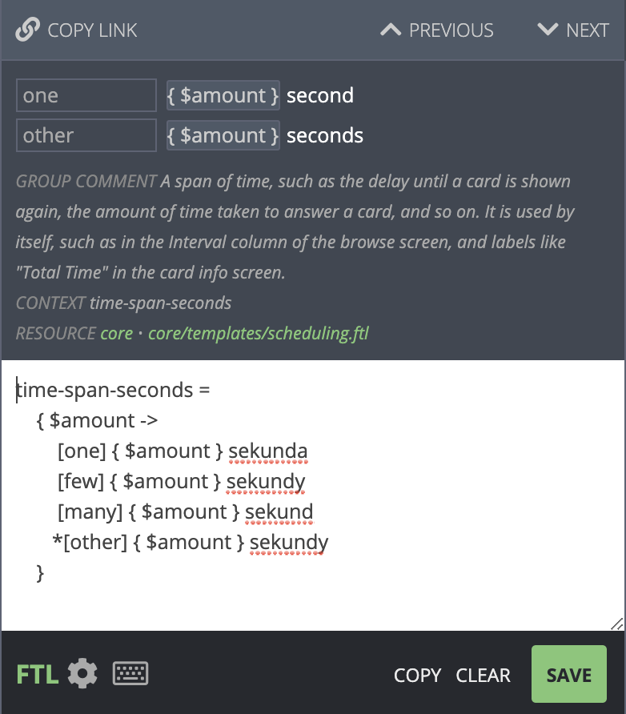

# Core Interface

The `core` module in the [translation site](https://i18n.ankiweb.net/projects)
uses a translations system called [Fluent](https://projectfluent.org/). It is
a recently-developed system that makes it easier for translators to deal with
plurals, and makes it easier for developers to provide useful comments to help
with translation.

Translations in the `core` module are divided up into multiple files, with each file
focusing on a particular topic, such as scheduling, deck options, and so on, as
can be seen [here](https://i18n.ankiweb.net/en-GB/core/).

## Simple Replacements


When the text is a simple string, all you need to do is write the text in your
native language and click Save (or press the Enter key).

Under the English text, many strings will contain a comment to help you understand
where the string is being used, or to give an example of how it appears.

"Context" is the short name for this string, and may sometimes give you a hint
as to where it is used or what it is trying to represent.

## Variables


When you see `{$something}` in the English text, it means that that text will
be replaced with something else. You can change the position of `{$something}`
in your translation, but please don't change the text inside - you should not
attempt to translate the text inside the `{...}` part. You can click on the
`{$something}` part of the English text to automatically copy it into your
translation.

## Plurals

Many languages change words depending on number. For example, English uses
"1 cat", but "3 cats".

Some of the strings to translate will look like this:


In the top part, you can see there are two forms for English - the `one`
case (second), and the `other` case (seconds).

The bottom section shows the translation in Polish, which has four different
plural forms. In this case, the `few` case and `many` case have been translated
with the same translation.

The translation website should automatically show the appropriate number
of boxes for your language. Languages like Japanese that do not have separate
plural forms will only need to enter in a translation once.

## Advanced Plurals

The translation website supports an advanced mode for when you need more
flexibility. You can access the advanced mode by clicking on the FTL icon
on the bottom left. The previous example then looks like this:



The first line is the unique identifier for this message - it can also be
seen in the "CONTEXT" label near the comments.

The rest of the text means the following:

- Check the value of amount
- If the amount is `one`, show `{$amount} sekunda`
- If the amount is `few`, show `{$amount} sekundy`
- If the amount is `many`, show `{$amount} sekund`
- If the amount is `other`, show `{$amount} sekundy`

The definitions of few, many and other depend on
[your language](https://unicode.org/cldr/charts/latest/supplemental/language_plural_rules.html).

The `*` character before other means that any unknown value should
match `other`. Since in this example `few` is the same as `other`, the
text could thus be shortened to:

```
time-span-seconds = { $amount ->
  [one]   { $amount } sekunda
  [many]  { $amount } sekund
 *[other] { $amount } sekundy
 }
```

As `few` is not listed here, it will be covered in the `other` case.
It's generally best to list out all cases however, as otherwise the
translation website will shown a warning that you may have forgotten
to translate a case.

When writing these rules manually, please make sure to add at least one
space to the start of each line except the first.

While there was little benefit from rewriting the text in this case, this
flexibility becomes useful when your language doesn't fit well with the
structure of the original English string.

For example, when viewing cards in the Browse screen in Anki, Anki shows
new cards with a number, such as "New #1", or "New #532". The English
doesn't use plurals in this case, but other languages may need to.

If you were translating this into Spanish, you'd see the following screen:


To add a plural form, click the FTL button, and then change the text
to read:

```
due-for-new-card = { $number ->
  [one]   Nueva #{ $number }
 *[other] Nuevas #{ $number }
 }
```

Here's another example. In this case the English text is using plurals
as well, but only a small part needs to change. When translating to Polish,
the "used by" portion needs to change as well. So the default editing
screen is not sufficient:


To fix this, we click on the FTL button to get a blank template:


And then modify the template as required:


## Other Languages

If you're not sure how something should be translated, you can click on the
Locales tab on the right. You can see a summary of the translation on that
screen, or click on a particular language to see how it has translated
all its plural forms.

## Special Characters

When a translated string is more than one line long, please keep an eye
out for lines that start with `.` or `[`. Strings can start with these characters
on the first line, but if a translation stretches over multiple lines, these
characters will cause problems.

For example, the following is fine:

```
some-translation =
  This is a translation that occurs
  over ... two
  or three lines.
```

But the following will cause problems, because the second line starts with a `[`,
and the third starts with a `.`:

```
some-translation =
  [This is a translation that occurs over
  ...two
  or three lines.]
```

When you need to use a `[` or `.` character at the start of a a line
in a multi-line string, please escape it by wrapping it in `{"` and
`"}` - for example:

```
some-translation =
  {"["}This is a translation that occurs over
  {"."}.. two
  or three lines.]
```

## Testing

Each time a new Anki beta is released, it will include any translation
changes that were made since the last time. Please give the betas a try,
so you can see how your translations appear in the app. There's a beta
testing section on the support site that you can follow for beta
updates.

When translating, please try to keep the translations about the same
length as the original English text. If it is not possible, and you find
that text is not appearing properly in a beta (such as two labels
overlapping), please report the issue on the support site.

When testing the betas, if you notice that some text is not
translatable, please report this on the support site so it can be fixed.
